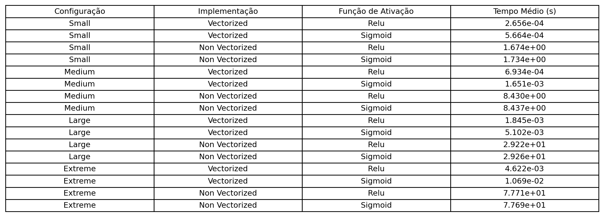
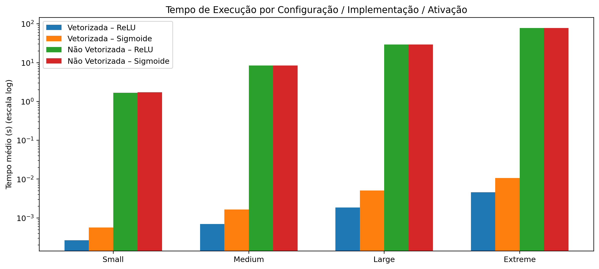

# Forward Propagation Configurável

##### Ludwig Aumann - GRR20191284

## Decisões de Projeto

- **Linguagem e libs**: Python 3.13 + NumPy/Matplotlib para vetorização e PyTest para testes.
- **Inicialização**: pesos pseudo-aleatórios com ReLU ou Sigmoide/Linear. Bias inicializado com zeros para estabilidade.
- **Dataset**: matriz sintética fixa (1.024 × 256) gerada com RNG determinístico (`seed=7`). O mesmo lote é reutilizado em todos os cenários para garantir comparações justas.
- **Ativações**: ReLU e Sigmoide nas camadas ocultas. Saída linear para facilitar medições numéricas.
- **Implementações**:
  - Vetorizada (`forward_vectorized`): operações `@`/broadcast em NumPy.
  - Não vetorizada (`forward_loop`): três laços explícitos (amostra × neurônio × feature).
- **Benchmarking**: reutiliza mesmos pesos/bias por configuração, mede tempo com `time.perf_counter()` e repete `runs=5` vezes. Resultados persistidos em CSV + gráfico sumário em `results/`.

## Configurações de Rede

| Tag     | Camadas ocultas | Neurônios por camada                          | Parâmetros (≈) |
| ------- | --------------- | --------------------------------------------- | -------------- |
| small   | 2               | [32, 16]                                      | 8.922          |
| medium  | 4               | [128, 64, 32, 16]                             | 43.930         |
| large   | 8               | [128] × 8                                     | 149.770        |
| extreme | 10              | [512, 256, 256, 128, 128, 64, 64, 32, 32, 16] | 394.362        |

## Ambiente de Teste

| Recurso     | Especificação                                    |
| ----------- | ------------------------------------------------ |
| CPU         | Apple M3 Pro                                     |
| RAM         | 18 GB                                            |
| SO          | macOS 14.5                                       |
| Python      | 3.13 (venv)                                      |
| Bibliotecas | NumPy 2.3, Matplotlib 3.10, PyTest 9             |
| Dataset     | 1.024 amostras × 256 features, float32, `seed=7` |
| Execuções   | Todas as configs: 5 repetições                   |

## Resultados de Desempenho (CPU)

As figuras em `results/plots/` são separadas:

- `config_table.png` (tabela de configurações), 
- `performance_table.png` (tabela de tempos médios)
- `execution_times.png` (gráfico de barras em escala log cobrindo todas as combinações de implementação/ativação).

## Análise

Small (ReLU): `forward_vectorized` executa em 3.46e-04 s por corrida média (5 repetições), entregando ~4,9 mil vezes o throughput da versão com laços e provando que mesmo a menor topologia opera abaixo do milissegundo.

Small (Sigmoide): o custo do `exp` adiciona ~1,9× de latência, mas ainda fica em 6.71e-04 s e preserva um speedup de ~2,6 mil vezes sobre o modo não vetorizado.

Medium (ReLU): com quatro camadas ocultas o tempo médio sobe para 7.24e-04 s, praticamente dobrando, mas continua claramente dominado por operações BLAS e segue ~12 mil vezes mais rápido que os laços.

Medium (Sigmoide): aqui aparece o pior caso relativo entre ativações: 3.19e-03 s (~4.4× mais lento que ReLU), ainda assim sustentando um ganho de ~2,7 mil vezes frente ao baseline não vetorizado.

Large (ReLU): mesmo com oito camadas de 128 neurônios, o tempo fica em 1.93e-03 s (~2 ms) e mantém vantagem de ~15,6 mil vezes sobre o loop.

Large (Sigmoide): chega a 5.09e-03 s; o fator ~2.6× sobre ReLU acompanha a tendência observada nas configurações menores e, mesmo assim, conserva um speedup de ~5,9 mil vezes.

Extreme (ReLU): para a arquitetura mais profunda (10 camadas e até 512 neurônios), o tempo médio é 4.90e-03 s — poucos milissegundos — e a vantagem chega a ~1,6 × 10⁴ vezes sobre o modo não vetorizado.

Extreme (Sigmoide): alcança 1.12e-02 s; representa a maior penalidade relativa (~2.3× vs. ReLU), porém mantém execução sub-20 ms e um ganho de ~7,1 mil vezes em relação ao loop.

A estratégia vetorizada cresce quase linearmente com os parâmetros (8.9k → 394k) ao passar de 0.35 ms (small/ReLU) para 4.90 ms (extreme/ReLU), enquanto os laços saltam de 1.70 s para 80 s — ganhos de 4,9 mil× até 16 mil× conforme a rede aumenta. ReLU permanece a opção mais barata (até 2,3× mais rápida que Sigmoide), e mesmo a Sigmoide fica entre 0.67 ms e 11.2 ms com speedups ≥2,6 mil× sobre o loop. Na prática, todas as topologias vetorizadas se mantêm responsivas em milissegundos, ao passo que a versão não vetorizada rapidamente se torna impraticável para arquiteturas médias em diante.

## Reprodutibilidade

1. `python -m venv .venv && source .venv/bin/activate`
2. `pip install -r requirements.txt`
3. `python -m benchmark.run_experiment`
4. `pytest`

Esses passos regeneram CSVs, metadados e figuras utilizados no relatório.
